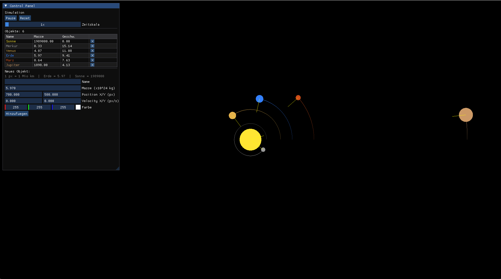

# GravitySim

A real-time 2D gravity simulation built with C++ and OpenGL. Bodies attract each other based on Newtonian physics, collide, merge, and leave trails as they orbit.



## Features

- **Newtonian gravity** – all bodies attract each other based on mass and distance
- **Collisions & absorption** – bodies merge on collision, conserving momentum
- **Trails** – each body leaves a fading trail showing its path
- **Solar System preset** – load a pre-configured solar system scene
- **Object management** – create and delete bodies at runtime via UI
- **Simulation controls** – pause, resume, reset, and adjust time scale

## Built With

| Library | Purpose |
|--------|---------|
| [OpenGL 3.3](https://www.opengl.org/) | Rendering |
| [GLFW 3.4](https://www.glfw.org/) | Window & input |
| [glad](https://glad.dav1d.de/) | OpenGL function loader |
| [glm](https://github.com/g-truc/glm) | Math (vectors, matrices) |
| [Dear ImGui](https://github.com/ocornut/imgui) | UI |

## Project Structure

```
GravitySim/
  src/
    main.cpp          – entry point
    simulation.cpp    – simulation loop
    object.cpp        – body logic
    physics.cpp       – gravitational laws
    database.cpp      – presets & save/load
    ui.cpp            – ImGui interface
    glad.c            – OpenGL function loader
    imgui/            – ImGui source files
  include/
    *.h               – own headers
    glad/             – glad header
    glm/              – math library (header-only)
    imgui/            – ImGui headers
    KHR/              – Khronos platform header
  CMakeLists.txt
```

## Build

**Requirements:**
- CMake 3.16+
- GCC / MinGW or MSVC
- Git (for fetching GLFW automatically)

```bash
git clone https://github.com/yourusername/GravitySim.git
cd GravitySim
cmake -B build
cmake --build build
./build/GravitySim.exe
```

GLFW is fetched and built automatically by CMake. No manual setup required.

## Planned Features

- 3D conversion
- Save & load custom scenes
- Object info on hover
- Keyboard shortcuts for object creation
